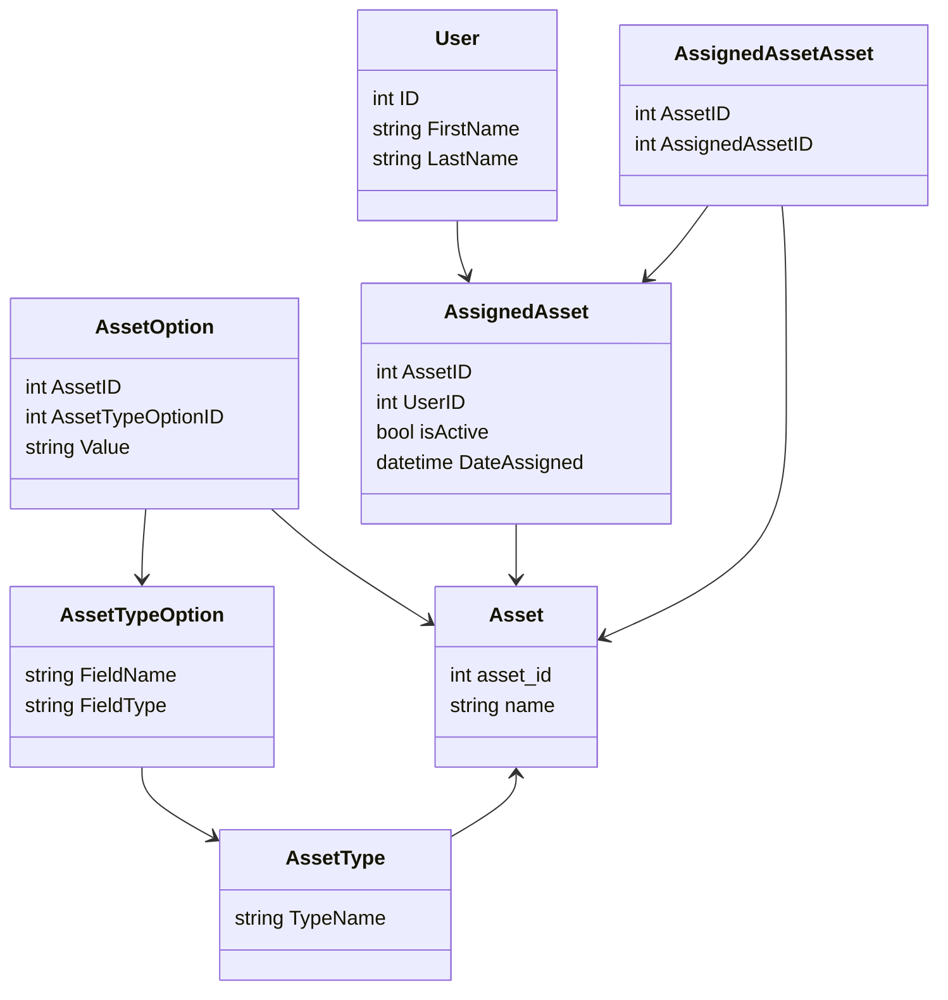

# Things to do
- Update bootstrap.sh to change add vagrant as owner of /usr/rvm after install chown user (folder-directory)

This graph is an attempt to design a database that can keep the history of assigned assets across different users as the assets are redistributed to other users.

> make sure to install mermaid to render the graph below

